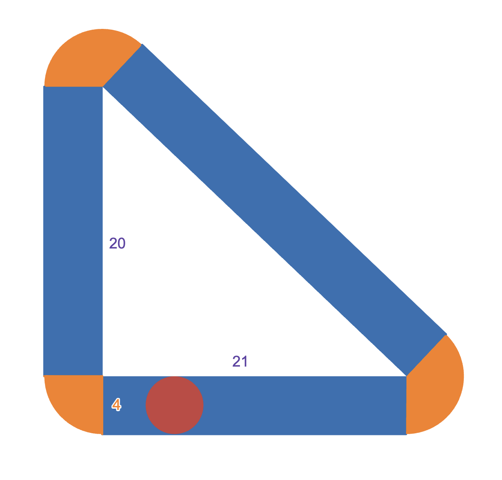



## Solutions

**Problem 1:** Compute the value of

$$\frac{2}{1+\frac{1+0}{1+\frac{1+2}{1+5}}}$$

*Solution*: $\frac{2}{1+\frac{1+0}{1+\frac{1+2}{1+5}}}=\frac{2}{1+\frac{1+0}{1+\frac{1}{2}}}=\frac{2}{1+\frac{1}{\frac{3}{2}}}=\frac{2}{1+\frac{2}{3}}=\frac{2}{\frac{5}{3}}=2\cdot\frac{3}{5}=\boxed{\frac{6}{5}}$. $\square$

**Problem 2:** Cities $A$ and $B$ are connected by a highway 100 miles long. Alice sets out from city $A$ towards $B$ at a constant rate of 20 miles per hour, while Bob sets out from city $B$ at $150%$ the speed of Alice. When the two meet, Bob speeds up to a constant $n$ miles per hour, while Alice continues towards $B$ at the same rate as before. (As soon as Bob reaches $A$, he turns around and sets back towards $B$.) Given that the two reach city $B$ at the same time, what is the numerical value of $n$? Round your answer to the nearest tenth.

**Problem 3**: A right triangle has legs of length $20$ and $21$. A circle of radius $2$ rolls about the outside perimeter of the triangle, always keeping tangent at one point. Suppose the area of the region “swept-out” by (only!) the rolling circle can be represented in the form $a+b\pi$, where both $a$ and $b$ are positive integers. Find $a+b$.

*Solution*:

The desired area is shaded in orange and blue. Observe that the three orange sectors form in total a circle of radius $4$, while the three blue rectangles have dimensions $4\times20,4\times21,4\times29$. Thus, the area in question is

$$4(20+21+29)+\pi\cdot4^2=280+16\pi$$

so that $a+b=280+16=\boxed{296}$. $\square$

**Problem 4**: A rigged coin is such that flipping 4 heads in a row is 4 times as likely as flipping 4 tails in a row. The probability that one flips 2 tails and 2 heads in some order can be represented as $m-n\sqrt{2}$ for positive integers $m$ and $n$. Find $m$.

**Problem 5**: Recall that the $n$th triangular number is defined to be the sum of the first $n$ positive integers. Similarly, define the $n$th tetrahedral number as the sum of the first $n$ triangular numbers. How many $k$ exist between $1$ and $100$ (inclusive) such that the $k$th tetrahedral number is divisible by $9$? 

*Solution*: The formula for the $n$-th triangular number is well known to be $T_n={n+1\choose{2}}=\frac{(n)(n+1)}{2}$. Perhaps less well known is that the $n$-th tetrahedral number is given by $V_n={n+2\choose{3}}=\frac{(n)(n+1)(n+2)}{3}$. A proof can be found [here](tetrahedral-numbers.html).

Using this fact, we seek the number of $1\leq n\leq 100$ such that $9\vert\frac{(k)(k+1)(k+2)}{3}$; this is equivalent to $27\vert(k)(k+1)(k+2)$. Since $k,k+1,k+2$ must have different remainders $\pmod{3}$, it follows that exactly one of them must be divisble by 3. However, since the entire expression is divisible by $27=3^3$, one of $k,k+1,k+2$ must be a multiple of 27. The only such positive integer $k$ less than 100 are 25, 26, 27, 52, 53, 54, 79, 80, and 81: a total of $\boxed{9}$. $\square$

**Problem 6**: Let $S$ be the list of (**possibly repeated**) rational numbers formed such for each $10$-tuple of nonnegative integers $(a_1,a_2,a_3,\dots,a_{10})$, the number  

$$n=\frac{1}{2^{a_1}3^{a_2}\cdots 11^{a_{10}}}$$

is added to $S$. Find the sum of the elements in $S$.

*For example*, the number $\frac{1}{4}$ is a result from both tuples $(2,0,0,0,0\dots,0)$ and $(0,0,1,0,0,\dots,0)$ and thus appears twice in the list.

*Solution*: It can be seen that this product is exactly equal to 

$$\begin{aligned}
\prod_{m=2}^{11}\left(\sum_{n=0}^\infty\frac{1}{m^n}\right)&=\left(1+\frac{1}{2}+\frac{1}{4}+\dots\right)\left(1+\frac{1}{3}+\frac{1}{9}+\dots\right)\left(1+\frac{1}{4}+\frac{1}{16}+\dots\right)\cdots\left(1+\frac{1}{11}+\frac{1}{121}+\dots\right) \\
&=\frac{1}{1-\frac{1}{2}}\cdot\frac{1}{1-\frac{1}{3}}\cdot\frac{1}{1-\frac{1}{4}}\cdot\cdots\cdot\frac{1}{1-\frac{1}{11}}\\
&=\frac{2}{1}\cdot\frac{3}{2}\cdot\frac{4}{3}\cdot\cdots\cdot\frac{11}{10}\\
&=\boxed{11}.
\end{aligned}$$

If this isn't immediately clear, consider the original problem statement. For any $n$, we are to select an arbitrary power of 2, then an arbitrary power of 3, ... and an arbitrary power of 11. At this point, if we take the reciprocal, our number has exactly the form we desire: $n=\frac{1}{2^{a_1}3^{a_2}\cdots 11^{a_{10}}}$. Now, in the nested sum-product mentioned above, we see that in its expansion, we take an arbitrary term from the first factor $\left(1+\frac{1}{2}+\frac{1}{4}+\dots\right)$, then from the second factor, and so forth. Since each of these factors, in order, provides a factor of $2^x$,$3^x$,..., their product is exactly the equation we seek. $\square$ 

**Problem 7**: Triangle $ABC$ is right at angle $B$. The midpoints of $AB$ and $BC$ are denoted as $M$ and $N$. Segments $AN$ and $CM$ intersect at point $P$ such that $PM=4$ and $PN=3$. Compute the square of the length of hypotenuse $\overline{AC}$.

