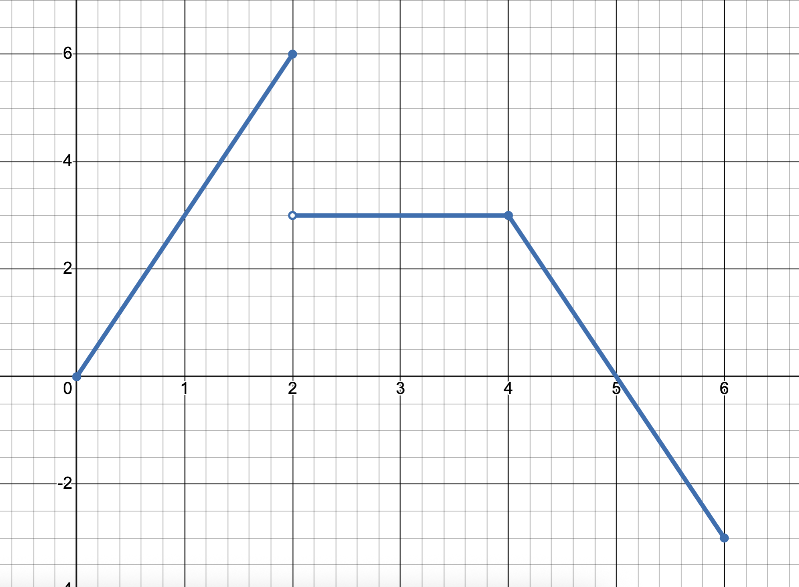



# 2026 YMC Solutions

### Answer Key

$\begin{array}{|c|c|c|c|c|}
\hline
1\,E & 6\,B & 11\,C & 16\,E & 21\,D \\ \hline
2\,C & 7\,A & 12\,A & 17\,D & 22\,B \\ \hline
3\,C & 8\,A & 13\,D & 18\,E & 23\,E \\ \hline
4\,C & 9\,C & 14\,D & 19\,D & 24\,C \\ \hline
5\,E & 10\,C & 15\,B & 20\,A &  \\ \hline
\end{array}$

### Problem 1

What is the sum of the positive factors of 2026 (including 1 and itself)? 

$\text{(A) } 1015\qquad 
\text{(B) } 2026\qquad 
\text{(C) } 2027\qquad 
\text{(D) } 3041\qquad 
\text{(E) } 3042$

*Solution:* We have $2026=2\cdot1013$, (1013 is prime) so the requested sum is

$$1+2+1013+2026=\boxed{\text{(E) } 3042}.\text{ }\square$$

---

### Problem 2

Compute the area of a triangle with two sides of length 13 and one side of length 10.

$\text{(A) } 30\qquad 
\text{(B) } 45\qquad 
\text{(C) } 60\qquad 
\text{(D) } 90\qquad 
\text{(E) } 120$

*Solution:* By dropping the altitude of the vertex opposite the side of length 10, we can split our triangle into two 5-12-13 right triangles. The area is thus $2\cdot\frac{1}{2}\cdot5\cdot12=\boxed{\text{(C) } 60}$. $\square$

---

### Problem 3

Mehul has 5 distinct textbooks that are to be stacked in a pile. Given that two of the textbooks, English and Math, must be put adjacent to each other, in how many ways can Mehul stack his textbooks?

$\text{(A) } 15\qquad 
\text{(B) } 24\qquad 
\text{(C) } 48\qquad 
\text{(D) } 60\qquad 
\text{(E) } 120$

*Solution:* By treating the English and Math textbooks as a singular block, we can effectively calculate the number of arrangements of 4 distinct units (the block and the other 3 books), *then* arrange the English and Math textbooks *within* the block. This evaluates to be $4!*2!=\boxed{\text{(C) } 48}$. $\square$

---

### Problem 4

During a stretch of 4 days, the weather forecast shows a 50% chance of rain on each day, independent of the previous. What is the probability it rains for *at least* 3 days in a row?

$\text{(A) } \frac{1}{16}\qquad 
\text{(B) } \frac{1}{8}\qquad 
\text{(C) } \frac{3}{16}\qquad 
\text{(D) } \frac{1}{4}\qquad 
\text{(E) } \frac{1}{3}$

*Solution:* Let a $R$ denote a rainy day, and $D$ denote a dry day. The satisfactory sequences of four letters are thus $RRRD,DRRR$, and $RRRR$. The probability is thus $\dfrac{3}{2^4}=\boxed{\text{(C) } \frac{3}{16}}$. $\square$

---

### Problem 5

Let the 2 distinct solutions to $x^2-5x-10=0$ be $p$ and $q$. Then the value of $p^2+q^2$ is

$\text{(A) } 20\qquad 
\text{(B) } 25\qquad 
\text{(C) } 30\qquad 
\text{(D) } 40\qquad 
\text{(E) } 45$

*Solution*: Note that $p^2+q^2=(p+q)^2-2pq$. By Vieta's relations, we obtain

$$\begin{cases}
p+q=5\\
pq=-10
\end{cases}$$

thus yielding $p^2+q^2=5^2-2(-10)=\boxed{\text{(E) } 45}$. $\square$

---

### Problem 6

The graph of $x^{2}y^{2}-x^{2}-y^{2}+1=0$ is best described as:

$\begin{aligned}
&\text{(A) Two concentric circles centered at the origin.} \\\\ 
&\text{(B) Two pairs of two parallel lines that form a square.}\\\\ 
&\text{(C) 3 lines that form an isosceles right triangle.} \\\\ 
&\text{(D) 2 parabolas, where one opens upward and one opens downward.} \\\\ 
&\text{(E) No such } (x,y) \text{ exist.} 
\end{aligned}$

### Problem 7

Avi and Jason have the following conversation regarding Jason’s favorite number:

$\begin{aligned}
&\text{Avi: "Is your favorite number greater than 50?"} \\\\ 
&\text{Jason: "Yes, and less than 80."} \\\\ 
&\text{Avi: "Is it divisible by 2?"} \\\\ 
&\text{Jason: "No."} \\\\ 
&\text{Avi: "Is it divisible by 5?"} \\\\ 
&\text{Jason: "Also no."} \\\\ 
&\text{Avi: "Ah — is it a prime number?"} \\\\ 
&\text{Jason: "Yes. Furthermore, the sum of the digits of my number is prime."} \\\\ 
&\text{Avi: "There are still two possible values..."} \\\\ 
&\text{Jason: "It’s the larger choice."} \\\\ 
\end{aligned}$

What is the positive difference between the two digits of Jason’s favorite number?

$\text{(A) } 1\qquad 
\text{(B) } 2\qquad 
\text{(C) } 3\qquad 
\text{(D) } 4\qquad 
\text{(E) } 5$

### Problem 8

Regular octagon $TINGSHUN'$ has side length $\sqrt{2}$. Compute the area of pentagon $STING$.

$\text{(A) } 2+2\sqrt{2} \qquad 
\text{(B) } 4+4\sqrt{2}\qquad 
\text{(C) } 2\sqrt{2}\qquad 
\text{(D) } 8\qquad 
\text{(E) } 16$

### Problem 9

The cornered hexagonal numbers are the numbers formed by a hexagonal formation arrangement of dots in the plane. The first four terms in the sequence are shown below:

  

 

What is the sum of the values of the first 7 cornered hexagonal numbers (starting from 1)?

$\text{(A) 161} \qquad 
\text{(B) 251} \qquad 
\text{(C) 252} \qquad 
\text{(D) 371} \qquad 
\text{(E) 372} $

### Problem 10

Consider the equation $4^{4^x}=2^{2^y}$. Which of the following is neccisarily true in $x$ and $y$?

$\text{(A) } y=2x\qquad 
\text{(B) } y=4x\qquad 
\text{(C) } y=2x+1\qquad 
\text{(D) } y=x+2\qquad 
\text{(E) } y=2^x$

### Problem 11

For how many real values of $a$ does $$\Big\vert x-\big\vert x-\vert ax\vert\big\vert\Big\vert =0$$ have infinitely many real solutions? 

$\text{(A) } 0\qquad 
\text{(B) } 2\qquad 
\text{(C) } 3\qquad 
\text{(D) } 4\qquad 
\text{(E) infinitely many} $

### Problem 12

On my biology final, each of the 90 problems are multiple choice, with 4 answer choices and exactly one correct answer. Suppose I answer $n$ questions correctly and guess the rest at random. What is the minimum *integer value* of $n$ such that the *expected value* of my score is at least an **A**? (An **A** is defined to be any percentage score greater than or equal to 92.5%.)

$\text{(A) } 81\qquad 
\text{(B) } 82\qquad 
\text{(C) } 83\qquad 
\text{(D) } 84\qquad 
\text{(E) } 85$

### Problem 13

In each of the below diagrams, we have a rhombus with diagonals of length 6 and 8. In the first diagram, two congruent circles are constructed externally tangent to each other *and* tangent to two sides each; in the second diagram, one large circle is placed tangent to *all* four sides. 

  

 

Let the combined area of the two circles in the first diagram be $A$, and let the area of the circle in the second diagram be $B$. Compute $\frac{B}{A}$.

$\text{(A) } \dfrac{25}{32}\qquad 
\text{(B) } \dfrac{25}{64}\qquad 
\text{(C) } \dfrac{64}{25}\qquad 
\text{(D) } \dfrac{32}{25}\qquad 
\text{(E) } 1$

### Problem 14

*(Proposed by Tingxuan Liu)* Tingxuan is a professional food critic. Today she is eating 370 mango flavored desserts. The first section includes 70 cheesecakes and the second section consists of 300 smoothies. Tingxuan eats at a constant speed for both sections, but her speed at the smoothie section is 40 “items” per hour faster than her speed at the cheesecake section, and the time she takes at the cheesecake section is exactly half the time she takes on the smoothie section. What is her average eating speed on the smoothie section (in smoothies per hour)?

$\text{(A) } \dfrac{280}{23}\qquad 
\text{(B) } 35\qquad 
\text{(C) } \dfrac{1200}{23}\qquad 
\text{(D) } 75\qquad 
\text{(E) } 115$

### Problem 15

Consider $\triangle ABC$; denote the midpoint of $AB$ as $M$ and the point $N$ as the point on side $BC$ (that is, between $B$ and $C$) where $CN:CB=k$. Let the intersection of $AN$ and $CM$ be $P$; if $CP=PM$, then the value of $k$ is equal to ___.

$\text{(A) } 1:2\qquad 
\text{(B) } 1:3\qquad 
\text{(C) } 2:3\qquad 
\text{(D) } 1:4\qquad 
\text{(E) } 3$

### Problem 16

Let $\gcd(L)$ and $\operatorname{lcm}(L)$ be the greatest common divisor and least common multiple functions respectively. Which of the following statements are always true for positive integers $a,b,c$?

|Item|Equation|
|:---:|:---|
|I.|$\gcd(a,b,c)=\gcd[\gcd(a,b),\gcd(b,c)]$|
|II.|$ab=\gcd(a,b)\cdot\operatorname{lcm}(a,b)$|
|III.|$\gcd(a^2,b^2)=[\gcd(a,b)]^2$|

$\begin{aligned}
&\text{(A) I only} \qquad
\text{(B) II only} \qquad
\text{(C) I and II only} \\\\
&\text{(D) II and III only} \qquad 
\text{(E) I, II and III}
\end{aligned}$

### Problem 17

Consider the set of points on the coordinate plane $S: y=\sqrt{-x^{2}+4x}$. There exist real values of $a$ such that $S$ and $y=x+a$ have exactly one intersection; furthermore, the set of possible values of $a$ can be represented as $a\in [m,n) \text{ or } a=\sqrt{p}-q$ for integers $m,n,p,q$. Compute $m+n+p+q$. (The $\in$ symbol denotes "is in".)

$\text{(A) -6} \qquad 
\text{(B) -4} \qquad 
\text{(C) 2} \qquad 
\text{(D) 6} \qquad 
\text{(E) 14} $

### Problem 18

We consider two cells to be adjacent if they share an edge. For instance, in the following array,

$$\begin{bmatrix}1 & 2 & 3\\4 & 5 & 6\\7 & 8 & 9\end{bmatrix}$$

Cells 1 and 2 are adjacent, but cells 5 and 9 are not. 

Now, let $S_0$ be a $3\times3$ array with 3 entries as 1 and the rest as 0. 

Suppose that in a process called a step, we construct array $S_1$ according to the following rules:

- If at least two of the four cells adjacent to a cell labeled 0 are labled 1, then that cell becomes a 1
- Otherwise, it stays a 0

An example is shown below:

$$\begin{array}{cc}
S_0 & S_1 \\
\begin{bmatrix}1&0&0\\1&0&0\\0&1&0\end{bmatrix} &
\begin{bmatrix}1&0&0\\1&1&0\\1&1&0\end{bmatrix}
\end{array}$$

We continue constructing arrays $S_2, S_3,\dots$ in a similar fashion until $S_i=S_{i-1}$ for some integer $i$ (i.e. no more changes can be made). For how many starting $S_0$ (with three entries 1) will $S_i$ be the array consisting of only 1’s?

$$\begin{bmatrix}1&1&1\\1&1&1\\1&1&1\end{bmatrix}$$

$\text{(A) 2} \qquad 
\text{(B) 4} \qquad 
\text{(C) 6} \qquad 
\text{(D) 10} \qquad 
\text{(E) 14} $

### Problem 19

The graph of $y=f(x)$ is shown. The sum of the real solutions of $f(f(f(x)))=0$ is

  

 

$\text{(A) } 0\qquad 
\text{(B) } 5\qquad 
\text{(C) } \dfrac{20}{3}\qquad 
\text{(D) } \dfrac{35}{3}\qquad 
\text{(E) } \dfrac{65}{9}$

### Problem 20 

The graph of $\left(\left\vert y-2x\right\vert-1\right)\left(\left\vert x-2y\right\vert-1\right)=0$ splits the coordinate plane into 9 distinct regions; exactly one of these has a finite area of $A$. Find $A$.

$\text{(A) } \dfrac{1}{3}\qquad 
\text{(B) } \dfrac{4\sqrt2}{3}\qquad 
\text{(C) } \dfrac{2}{3}\qquad 
\text{(D) } \dfrac{2\sqrt2}{3}\qquad 
\text{(E) } \dfrac{4}{5}$

### Problem 21 

Rectangle $ABCD$ has $AB=2$ and $BC=1$. Circle $\omega$ passes through $A$, $D$, and the midpoints of $AB$ and $CD$. Diagonal $AC$ intersects $\omega$ at point $P$. Find the area of triangle $ADP$.

$\text{(A) } \dfrac{1}{3}\qquad 
\text{(B) } \dfrac{2}{5}\qquad 
\text{(C) } \dfrac{1}{2}\qquad 
\text{(D) } \dfrac{3}{5}\qquad 
\text{(E) } \dfrac{2}{3}$

### Problem 22 

Let the four roots of the equation $x^4+x^3+4x^2+2x+4=6x^2$ be $r_1,r_2,r_3,r_4$. Find the value of:

$$\left(r_1+\frac{2}{r_1}\right)+\left(r_2+\frac{2}{r_2}\right)+\left(r_3+\frac{2}{r_3}\right)+\left(r_4+\frac{2}{r_4}\right)$$

$\text{(A) } -4\qquad 
\text{(B) } -2\qquad 
\text{(C) } -1\qquad 
\text{(D) } 1\qquad 
\text{(E) } 2$

### Problem 23 

The last two digits (from the left) of $11^{2026}$ are:

$\text{(A) } 01\qquad 
\text{(B) } 11\qquad 
\text{(C) } 21\qquad 
\text{(D) } 41\qquad 
\text{(E) } 61$

### Problem 24 

There exists a unique integer value of $n$ such that, in degrees, the interior angle measure of a $(n-1)$-gon is $6^\circ$ more than the interior angle measure of a $(n+1)$-gon. Find $n$.

$\text{(A) } 7\qquad 
\text{(B) } 9\qquad 
\text{(C) } 11\qquad 
\text{(D) } 13\qquad 
\text{(E) } 15$

