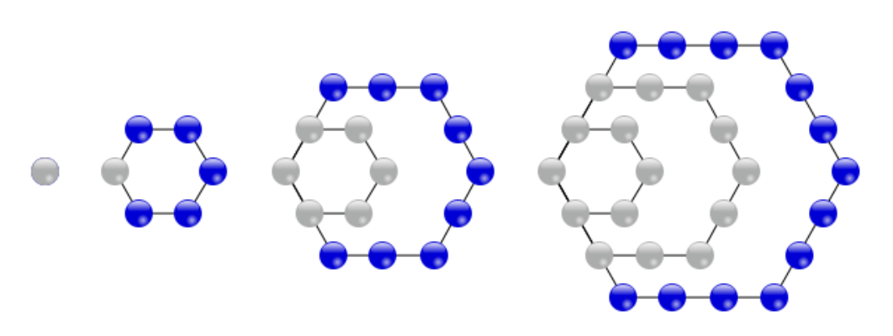



# 2026 YMC Problems
**Problem 1:** What is the sum of the positive factors of 2026 (including 1 and itself)? 

$\text{(A) } 1015\quad 
\text{(B) } 2026\quad 
\text{(C) } 2027\quad 
\text{(D) } 3041\quad 
\text{(E) } 3042$

**Problem 2:** Compute the area of a triangle with two sides of length 13 and one side of length 10.

$\text{(A) } 30\quad 
\text{(B) } 45\quad 
\text{(C) } 60\quad 
\text{(D) } 90\quad 
\text{(E) } 120$

**Problem 3:** Mehul has 5 distinct textbooks that are to be stacked in a pile. Given that two of the textbooks, English and Math, must be put adjacent to each other, in how many ways can Mehul stack his textbooks?

$\text{(A) } 15\quad 
\text{(B) } 24\quad 
\text{(C) } 30\quad 
\text{(D) } 60\quad 
\text{(E) } 120$

**Problem 4:** During a stretch of 4 days, the weather forecast shows a 50% chance of rain on each day, independent of the previous. What is the probability it rains for at least 3 days in a row?

$\text{(A) } \frac{1}{16}\quad 
\text{(B) } \frac{1}{8}\quad 
\text{(C) } \frac{3}{16}\quad 
\text{(D) } \frac{1}{4}\quad 
\text{(E) } \frac{1}{3}$

**Problem 5:** Let the 2 distinct solutions to $x^2-5x-10=0$ be $p$ and $q$. Then the value of $p^2+q^2$ is

$\text{(A) } 20\quad 
\text{(B) } 25\quad 
\text{(C) } 30\quad 
\text{(D) } 40\quad 
\text{(E) } 45$

**Problem 6:** The graph of $x^{2}y^{2}-x^{2}-y^{2}+1=0$ is best described as:

$\begin{aligned}
&\text{(A) Two concentric circles centered at the origin.} \\ 
&\text{(B) Two pairs of two parallel lines intersecting at } 90^\circ \text{ angles.} \\ 
&\text{(C) 3 lines that form an isosceles right triangle.} \\ 
&\text{(D) 2 parabolas, where one opens upward and one opens downward.} \\
&\text{(E) No such } (x,y) \text{ exist.} 
\end{aligned}$

**Problem 7:** Avi and Jason have the following conversation regarding Jason’s favorite number:

$\begin{aligned}
&\text{Avi: Is your favorite number greater than 50?”}\\\\
&\text{Jason: “Yes, and less than 80.”}\\\\
&\text{Avi: “Is it divisible by 2?”}\\\\
&\text{Jason: “No.”}\\\\
&\text{Avi: “Is it divisible by 5?”}\\\\
&\text{Jason: “Also no.”}\\\\
&\text{Avi: “Ah — is it a prime number?”}\\\\
&\text{Jason: “Yes. Furthermore, the sum of the digits of my number is prime.”}\\\\
&\text{Avi: “There are still two possible values…”}\\\\
&\text{Jason: “It’s the larger choice.”}\\\\
\end{aligned}$

What is the positive difference between the two digits of Jason’s favorite number?

$\text{(A) } 1\quad 
\text{(B) } 2\quad 
\text{(C) } 3\quad 
\text{(D) } 4\quad 
\text{(E) } 5$

**Problem 8:** Regular octagon $TINGSHUN'$ has side length $\sqrt{2}$. Compute the area of pentagon $STING$.

$\text{(A) } 2+2\sqrt{2} \quad 
\text{(B) } 4+4\sqrt{2}\quad 
\text{(C) } 2\sqrt{2}\quad 
\text{(D) } 8\quad 
\text{(E) } 16$

**Problem 9:** The cornered hexagonal numbers are the numbers formed by a hexagonal formation arrangement of dots in the plane. The first four terms in the sequence are shown below:

  

 

What is the sum of the values of the first 7 cornered hexagonal numbers (starting from 1)?

$\text{(A) 161} \quad 
\text{(B) 251} \quad 
\text{(C) 252} \quad 
\text{(D) 371} \quad 
\text{(E) 372} $

**Problem 10:** 

$\text{(A) } \quad 
\text{(B) } \quad 
\text{(C) } \quad 
\text{(D) } \quad 
\text{(E) } $

**Problem 11:** 

$\text{(A) } \quad 
\text{(B) } \quad 
\text{(C) } \quad 
\text{(D) } \quad 
\text{(E) } $

**Problem 12:** 

$\text{(A) } \quad 
\text{(B) } \quad 
\text{(C) } \quad 
\text{(D) } \quad 
\text{(E) } $

**Problem 13:** 

$\text{(A) } \quad 
\text{(B) } \quad 
\text{(C) } \quad 
\text{(D) } \quad 
\text{(E) } $

**Problem 14:** 

$\text{(A) } \quad 
\text{(B) } \quad 
\text{(C) } \quad 
\text{(D) } \quad 
\text{(E) } $

**Problem 15:** 

$\text{(A) } \quad 
\text{(B) } \quad 
\text{(C) } \quad 
\text{(D) } \quad 
\text{(E) } $

**Problem 16:** 

$\text{(A) } \quad 
\text{(B) } \quad 
\text{(C) } \quad 
\text{(D) } \quad 
\text{(E) } $

**Problem 17:** 

$\text{(A) } \quad 
\text{(B) } \quad 
\text{(C) } \quad 
\text{(D) } \quad 
\text{(E) } $

**Problem 18:** 

$\text{(A) } \quad 
\text{(B) } \quad 
\text{(C) } \quad 
\text{(D) } \quad 
\text{(E) } $

**Problem 19:**

$\text{(A) } \quad 
\text{(B) } \quad 
\text{(C) } \quad 
\text{(D) } \quad 
\text{(E) } $

**Problem 20:** 

$\text{(A) } \quad 
\text{(B) } \quad 
\text{(C) } \quad 
\text{(D) } \quad 
\text{(E) } $

**Problem 21:** 

$\text{(A) } \quad 
\text{(B) } \quad 
\text{(C) } \quad 
\text{(D) } \quad 
\text{(E) } $

**Problem 22:** 

$\text{(A) } \quad 
\text{(B) } \quad 
\text{(C) } \quad 
\text{(D) } \quad 
\text{(E) } $

**Problem 23:** 

$\text{(A) } \quad 
\text{(B) } \quad 
\text{(C) } \quad 
\text{(D) } \quad 
\text{(E) } $

**Problem 24:** 

$\text{(A) } \quad 
\text{(B) } \quad 
\text{(C) } \quad 
\text{(D) } \quad 
\text{(E) } $

