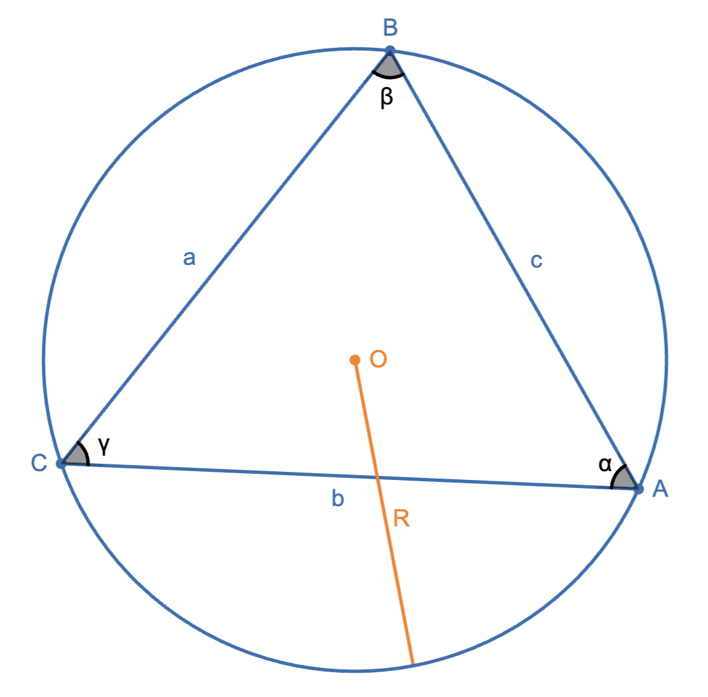
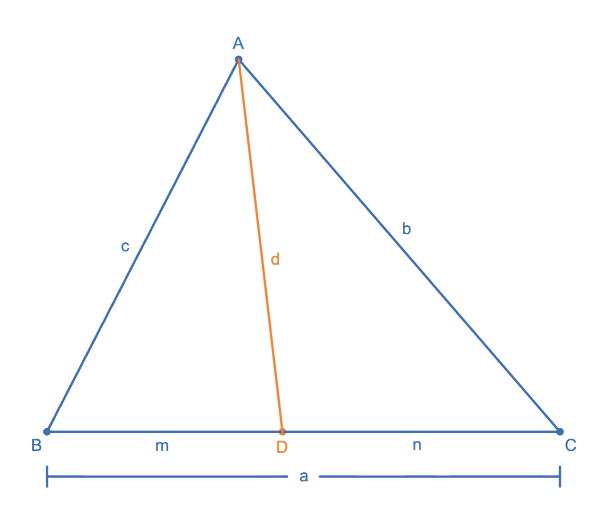



# Theorems

**Law of Sines**: $\dfrac{a}{\sin\alpha}=\dfrac{b}{\sin\beta}=\dfrac{c}{\sin\gamma}=2R$.

*Ratio Lemma*: $\dfrac{BD}{DC}=\dfrac{\sin\alpha_1}{\sin\alpha_2}\cdot\dfrac{AB}{AC}$

**Law of Cosines**: $c^2=a^2+b^2-2ab\cos C$

  

 

**Stewart's Theorem**: $d^2=\dfrac{c^2n+b^2m}{a}-mn$. Alternatively, can be remembered easily using: $man+dad=bmb+cnc\Longleftrightarrow$ "*A man and his dad put a bomb in the sink*"

  

 

*Corr 1*: $AD$ is median. Then $d^2=\dfrac{c^2+b^2}{2}-\dfrac{a^2}{4}$
*Corr 2*: $AD$ is angle bisector. Then $d^2=bc\left(1-\dfrac{a^2}{(b+c)^2}\right)$

**Carnot's Theorem**: $BX^2+CY^2+AZ^2=BZ^2+CX^2+AY^2\Longleftrightarrow\exists \text{ }P, P\perp BC,PY\perp AC,PZ\perp AB$.

  

 
