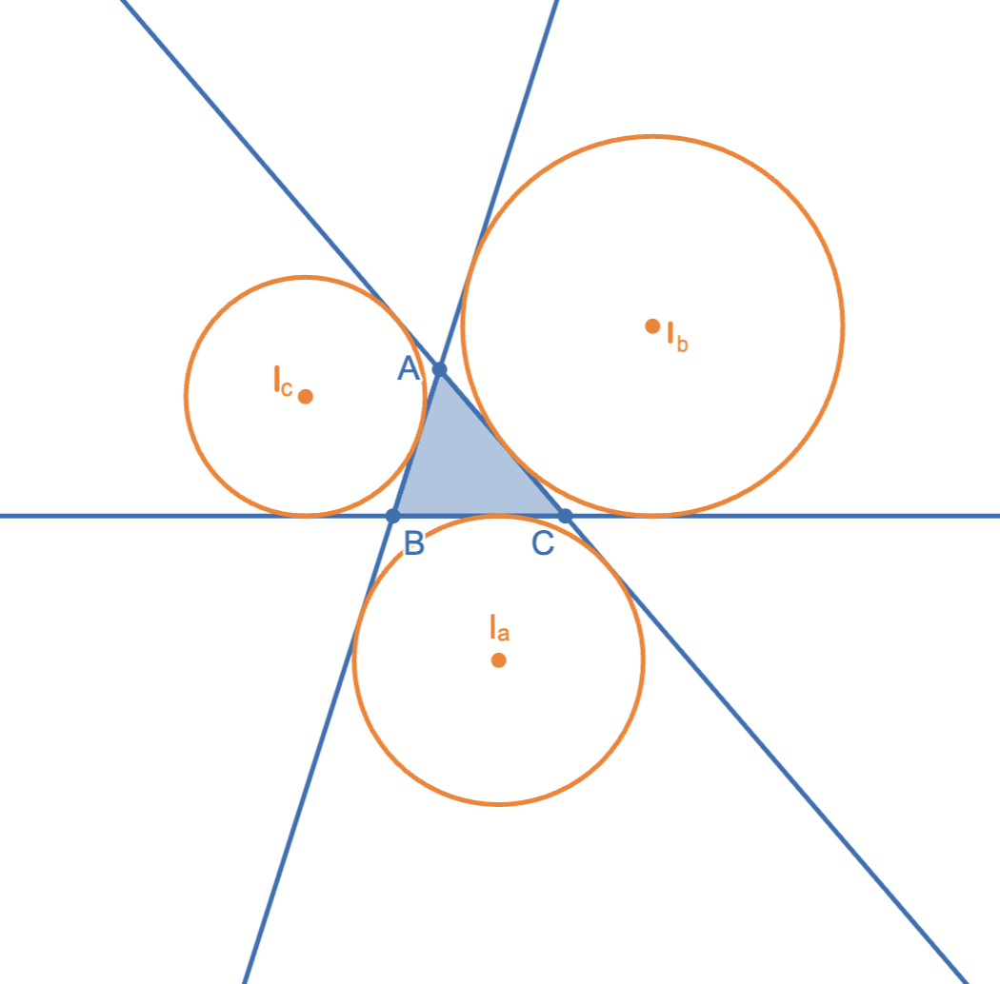



# Theorems

**Law of Sines**: $\dfrac{a}{\sin\alpha}=\dfrac{b}{\sin\beta}=\dfrac{c}{\sin\gamma}=2R$.

*Ratio Lemma*: $\dfrac{BD}{DC}=\dfrac{\sin\alpha_1}{\sin\alpha_2}\cdot\dfrac{AB}{AC}$.

**Law of Cosines**: $c^2=a^2+b^2-2ab\cos C$.

  

 

**Stewart's Theorem**: $d^2=\dfrac{c^2n+b^2m}{a}-mn$. Alternatively, can be remembered easily using: $man+dad=bmb+cnc\Longleftrightarrow$ "*A man and his dad put a bomb in the sink*."

  

 

*Corr 1*: $AD$ is median. Then $d^2=\dfrac{c^2+b^2}{2}-\dfrac{a^2}{4}$.
*Corr 2*: $AD$ is angle bisector. Then $d^2=bc\left(1-\dfrac{a^2}{(b+c)^2}\right)$.

**Carnot's Theorem**: $BX^2+CY^2+AZ^2=BZ^2+CX^2+AY^2\Longleftrightarrow\exists \text{ }P, PX\perp BC,PY\perp AC,PZ\perp AB$.

  

 

**Area of Triangle I**: $[ABC]=\dfrac{1}{2}ab\sin C=\dfrac{1}{2}bc\sin A=\dfrac{1}{2}ac\sin B=\dfrac{abc}{4R}$.

**Heron's formula:** $[ABC]=\sqrt{s(s-a)(s-b)(s-c)},$ where $s=\dfrac{a+b+c}{2}$.

*Corollary*: In terms of only side lengths: $[ABC]=\dfrac{1}{4}\sqrt{4a^2b^2-(a^2+b^2-c^2)^2}$.

**Area of Tiangle II**: Let the radii of the excircles tangent to sides $AB$, $BC$, and $AC$ have radius $r_c,r_a,r_b$. Then $[ABC]=r_a(s-a)=r_b(s-b)=r_c(s-c)$, where $s=\frac{a+b+c}{2}$.

  

 

**Bretschneider's Formula**: $[ABCD]=\sqrt{(s-a)(s-b)(s-c)(s-d)-abcd\cos\left(\dfrac{\angle B+\angle D}{2}\right)}$, where $s=\dfrac{a+b+c+d}{2}$.

*Corollary (Brahmagupta's Formula)*: If $ABCD$ is cyclic, then $[ABCD]=\sqrt{(s-a)(s-b)(s-c)(s-d)}$ since $\angle B+\angle D=180^\circ$

**HM-AM-GM-QM chain**: For positive $a_{1,2\dots,n}$:

$$\sqrt{\dfrac{\displaystyle\sum_{i=1}^n a_i^2}{n}}\geq \dfrac{\displaystyle\sum_{i=1}^n a_i}{n}\geq \sqrt[n]{\prod_{i=1}^n a}\geq\dfrac{n}{\displaystyle\sum_{i=1}^n \frac{1}{a_i}}$$ with equality $\mathbf{iff}$ $a_1=a_2=\dots=a_n$.

**Cauchy-Schwarz**: For positive $a_{1,2\dots,n}, b_{1,2\dots,n}$:

$$\left(\sum_{i=1}^n a_i^2\right)\left(\sum_{i=1}^n b_i^2\right)\geq\left(\sum_{i=1}^n a_ib_i\right)^2$$

with equality $\mathbf{iff}$ $\dfrac{a_1}{b_1}=\dfrac{a_2}{b_2}=\dots=\dfrac{a_n}{b_n}$.

*Ravi's Substitution*: If $a,b,c$ are sides of a triangle, then there always exist positive $x,y,z$ such that:

$$\begin{cases}
a=y+z \\
b=x+z \\
c=x+y.
\end{cases}$$

While not a "theorem," Ravi's substitution is often a powerful method to solve strange inequalities.