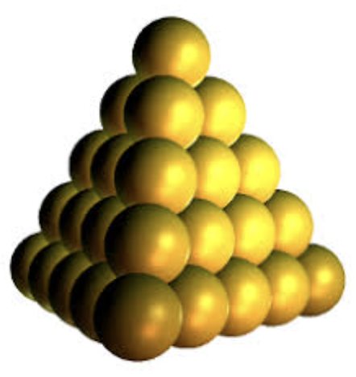


# Tetrahedral numbers
Tetrahedral numbers are essentially the 3-dimensional version of triangular numbers. To construct them, imagine stacking balls in a triangular pyramid, as shown:

In fact, we can directly construct tetrahedral numbers as a sum of triangular numbers! (Visulize this as making the first $n$ triangular numbers using balls, then stacking each of those ball-triagles on top of each other). Let the $n$-th tetrahedral and $n$-th triangular numbers be denoted as $V_n$ and $T_n$, respectively. Then it follows

---

**Thm 1**: $V_n=T_n+T_{n-1}+\dots+T_2+T_1$ for $n\in\mathbb{N}$

---

Next, we show the general formula for tetrahedral numbers.

---

**Thm 2**: $V_n=\dfrac{(n)(n+1)(n+2)}{6}$ for $n\in\mathbb{N}$

**Proof**: We proceed with weak induction:

*Base Case*: $n=1$. Indeed, $V_1=\frac{1\cdot2\cdot3}{6}=1$, so the base case holds.

*Inductive Step*: Suppose $n=-1$ were true; we are now to prove $n=k$, which is equivalent to the following:

$$V_k=\dfrac{(k)(k+1)(k+2)}{6}$$

Using (**Thm 1**), we may expand $V_k$:

$$V_{k-1}+T_k=\dfrac{(k)(k+1)(k+2)}{6}$$

We know both of these variables in terms of $k$; thus, it suffices to show that

$$\dfrac{(k-1)(k)(k+1)}{6}+\frac{(k)(k+1)}{2}=\dfrac{(k)(k+1)(k+2)}{6}$$

Simplify:

$$\begin{gathered}
& (k-1)(k)(k+1)+3(k)(k+1)=(k)(k+1)(k+2)\\
& (k-1)+3=(k+2)\\
& k=k
\end{gathered}$$

which completes the proof. $\blacksquare$

---